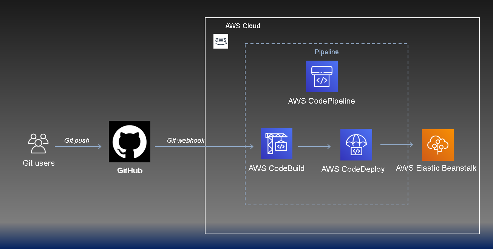
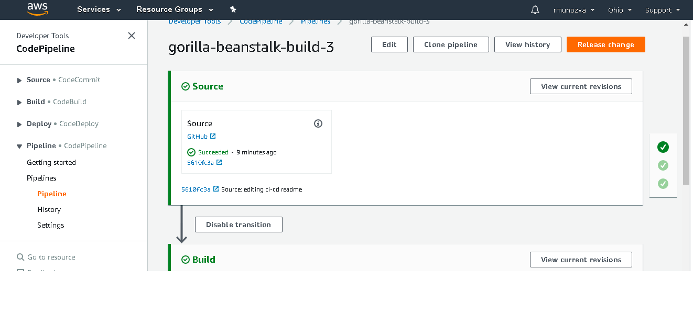
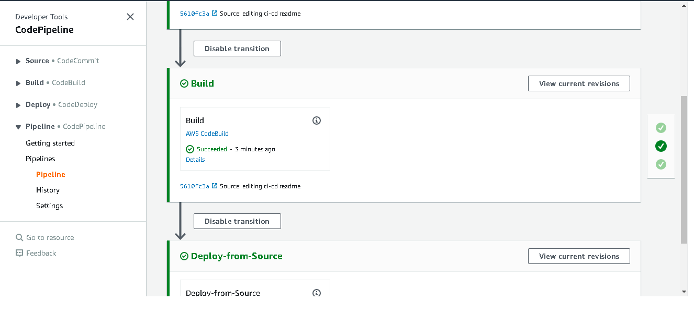
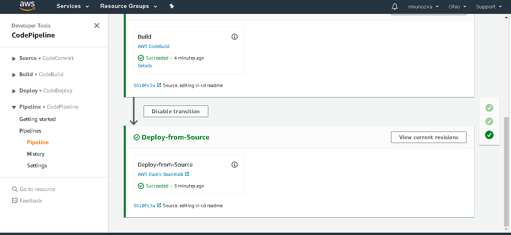
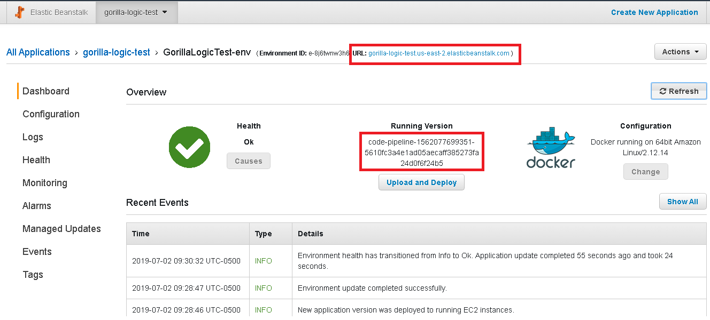
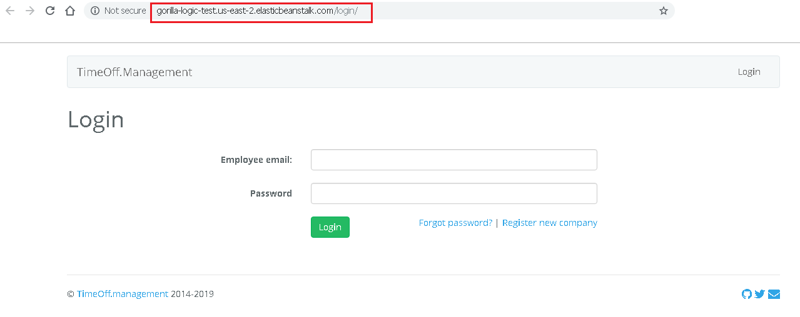

## Architecture

## Flow
- Source: Github
- Continuous Integration: AWS CodeBuild - leveraged `buildspec.yml` to build the codebase
- Continuous Deployment: AWS CodeDeploy - leveraged Amazon Elastic BeanStalk for deployment

## Github -> 
- Github would be our Source Control Management Tool
- Everytime code get "push" to the repository a hook would be triggered and start the pipeline

## CodeBuild -> 
- Once the hook is triggered and the pipeline starts, CodeBuild will start the Continuos Integration
- CodeBuild will do the build of the necessary dependencies for the application to run
- The build is done by following the steps spedified in the buildspe.yml file
- Once the build is completed successfully CodeDeploy will be triggered

## CodeDeploy -> 
- Once CodeDeploy has been triggered it would start to Continuos Deployment
- CodeDeploy will deploy the application to Elastic Bean Stalk

## BeanStalk View -> 

## WebAppDeployed View ->

